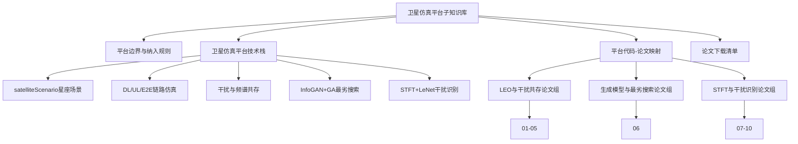

---
tags:
  - 总览
  - 卫星
  - 仿真平台
---

# 卫星仿真平台子知识库总览

## 定位
这个子知识库只保留卫星仿真平台本身的技术链：
- `satelliteScenario` 星座与几何场景
- `DL / UL / E2E` 链路级仿真
- 干扰与共信道代理模型
- `InfoGAN + GA` 最劣场景搜索
- `STFT + LeNet` 干扰分类
- Dashboard 与结果输出

## 明确排除
- 不收录卫星正向设计
- 不收录车载终端/专利/结构设计
- 不收录无人机项目
- 不收录 `classify`、`LEO_Sim` 外的其他工程线

## 知识网络

## 入口文件
- 主入口：`v7proj/LEO_StarNet_EMC_V7_0_Engineering.m`
- 链路求解：`v7proj/simulateStarNetV7.m`
- 最劣搜索：`v7proj/trainOrLoadJammerGAN.m` + `v7proj/worstCaseObjectiveV7.m`
- 干扰识别：`v7proj/getOrTrainLeNetSTFT.m` + `v7proj/classifyInterferenceTimeline_powerSampler.m`

## 建议阅读顺序
1. [[../01_平台架构/平台边界与纳入规则]]
2. [[../01_平台架构/卫星仿真平台技术栈]]
3. [[../02_代码映射/平台代码-论文映射]]
4. [[../98_索引/论文下载清单]]
